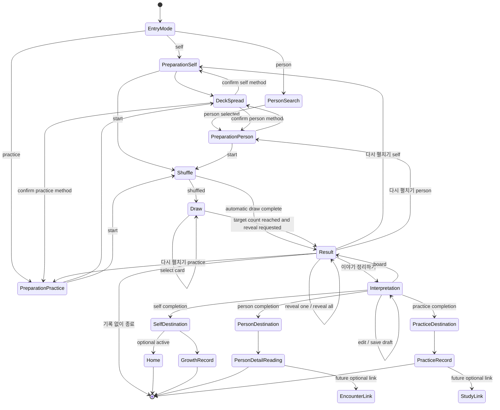

# Tarot Person-Centered Reading Workspace Design 1

- **Task:** `TAROT-PERSON-CENTERED-READING-WORKSPACE-DESIGN1`
- **Status:** Owner review candidate
- **Scope:** Read-only product architecture and visual design
- **Platform:** Flutter Desktop, Windows-first, local-first
- **Inspected baseline:** `ea8b56c71da3c7c4cf6b9dfaeb3d818e565e39ea`
- **Normative boundary:** This document does not authorize source, schema, migration, repository, persistence, backup/restore, Git, or runtime changes.
- **Related contracts:** [Ryn Adaptive Workspace Design System R2](./RYN-ADAPTIVE-WORKSPACE-DESIGN-SYSTEM-R2.md), [Ryn Apple-Neutral Design System R1](./RYN-APPLE-NEUTRAL-DESIGN-SYSTEM-R1.md)

> **Product formula**
>
> Person or self context + one clear question + cinematic card ritual + whole-spread story + explicit record destination
>
> **User-facing flow:** `대상과 질문 → 카드 리딩 → 이야기와 기록`

---

## 1. Current-state diagnosis

### 1.1 Source boundary inspected

The current Tarot implementation is concentrated in `lib/features/tarot/tarot_spread_shell.dart`. It already owns:

- a staged in-memory flow (`setup`, `draw`, `result`, `interpretation`);
- question category and free-question state;
- additional question, querent, session, and caution fields;
- deck, card-back, cloth, spread, position, and direction settings;
- shuffle, manual card selection, automatic draw, reveal, result-board capture, and interpretation drafting;
- immutable completed-result identity through `TarotReadingResultSnapshot`;
- callback seams for completed-reading persistence, interpretation persistence, Home, and Records.

The current People boundary provides:

- persistent `Person`, `PersonRole`, `PersonGroup`, and `PersonGroupMembership` identities;
- active-person watching and selection;
- search across display name, relationship summary, role, and group;
- Person Detail tabs including an empty `리딩` destination;
- `Encounter` as the canonical meeting/interaction aggregate.

The boundaries are separate. No inspected Tarot result, persistence input, repository, or table currently carries `personId`, reading mode, source context, or encounter linkage.

### 1.2 Setup

**What works**

- Setup has already begun an Apple-neutral R2 migration.
- Question/category/deck/spread controls exist and are functional concepts.
- Deck covers, card backs, spread previews, orientation, cloth, and position labels provide strong Tarot identity.
- Progressive detail is possible because the source already separates basic and supporting question fields.

**Diagnosis**

- The visible structure is still an eight-step wizard inside a ten-item global stepper.
- `인트로 / 카테고리 / 질문 / 상담 정보 / 요약 / 덱 / 세부 설정 / 셔플` describes implementation steps, not the user's purpose.
- Person identity is collected as duplicated free text (`querentAlias`, relationship, birth note) instead of a People reference.
- Setup mixes three different decisions—target, question, and reading method—into serial pages, adding friction before the cinematic moment.
- Numbering is internally inconsistent: question intake reaches step 5, while deck setup restarts its visible numbering at 2.

### 1.3 Shuffle

**What works**

- A ritual transition exists and can preserve anticipation.
- The selected deck, spread, card back, and table atmosphere already have visual continuity.

**Diagnosis**

- Shuffle is not a distinct top-level product state; it is split between the final setup panel and draw-phase mechanics.
- The ritual is surrounded by legacy dark/gold chrome rather than a neutral application frame with a bounded indigo stage.
- Target and question continuity are not compactly expressed as one stable reading context.

### 1.4 Draw

**What works**

- Manual selection, automatic draw, selection order, card fan, remaining count, and transition to result are mature.
- The card fan is appropriately the visual protagonist.

**Diagnosis**

- The command bar gives several controls comparable weight.
- Deep navy, broad colored cloth surfaces, purple feedback, gold controls, gradients, particles, and large shadows compete with the cards.
- Context is fragmented across deck/spread text, status chips, and a ribbon.
- The current layout treats all 78 cards inside a large decorated panel; the stage risks becoming the protagonist instead of the card fan.

### 1.5 Result

**What works**

- Full-spread geometry, individual reveal, reveal-all, direction correction before freeze, image export, and interpretation handoff exist.
- The board can be captured as a coherent visual snapshot.

**Diagnosis**

- The screen does not answer “who was this for?” because the result contract has no target identity.
- The top command area contains back, reset, status, helper, reveal, export, and interpretation controls with insufficient hierarchy.
- `해석 보기` undersells the intended next step; the product action is story formation and record completion.
- `다시 펼치기` and exit behavior need clearer consequence and lower visual weight.

### 1.6 Interpretation

**What works**

- The approved whole-spread storytelling model already exists: left snapshot and right narrative fields.
- Existing fields cover whole-image observation, flow, core message, and small action.
- Draft identity is bound to the completed reading instance.

**Diagnosis**

- The fifth requested prompt, `다음에 볼 것`, is absent from the current draft model and persistence contract.
- The entire workspace remains wrapped in legacy cinematic chrome; writing controls should return to neutral R2 surfaces.
- Save status, Home, Growth Record, Records, and new-reading actions are mixed without a destination model.
- Person, self, and practice outcomes cannot diverge because no reading mode or destination contract exists.

### 1.7 Person integration

- People has durable identities, roles, relationships, groups, and a Person Detail `리딩` tab.
- Tarot has a completed-reading aggregate and record lifecycle.
- There is no cross-domain reference or projection between them.
- Current querent free text must not become the Person integration strategy.
- `Encounter`, not a new generic “meeting” entity, is the correct future optional linkage target.

**Current-state verdict:** The Tarot engine and card experience are strong enough to preserve. The redesign should replace the workflow frame and context contract, not rewrite deck, spread, selection, reveal, or spread geometry.

---

## 2. Design principles

1. **Start with who and why.** Every reading begins by choosing `나`, one existing Person, or `연습 리딩`, then clarifying one question.
2. **Reference identity; never duplicate it.** Person name, relationship, role, and group are resolved from People. Tarot stores or carries only identity/reference data required by the approved contract.
3. **Three phases, not a generic wizard.** The product journey is `대상과 질문 → 카드 리딩 → 이야기와 기록`.
4. **Cards own the ritual.** Shuffle, fan, draw, reveal, and board protect card scale and spatial composition.
5. **Neutral application, bounded atmosphere.** Shell, headers, inputs, writing panes, and utility actions use R2 neutrals and Blue. Restrained indigo belongs only inside the ritual viewing area.
6. **Gold marks meaning, not ordinary interaction.** Use Gold for card edges, a single ritual cue, and symbolic moments—not navigation, selection, focus, or every CTA.
7. **One main action per screen.** Secondary and exit actions remain available but visually subordinate.
8. **Context travels without becoming chrome.** Target, category, spread, card count, and selection count occupy one compact context line.
9. **Progressive disclosure protects calmness.** Only target, core question, and reading method are open by default. Supporting context lives under `자세히 설정`.
10. **Whole-spread story over card-by-card form.** Interpretation begins with the full scene and narrative arc; card facts remain supporting inspection.
11. **Destination is part of completion.** Self, Person, and practice modes clearly state where the reading will belong before the final action.
12. **No premature persistence promise.** UI-only and in-memory milestones must not use copy implying durable Person linkage until the persistence gate passes.

---

## 3. Target information architecture

### 3.1 Recommended user-facing labels

**Recommend Option B:**

1. `대상과 질문`
2. `카드 리딩`
3. `이야기와 기록`

**Why Option B is better**

- It describes the user's mental model and the content protagonist, not system phases.
- `준비 / 리딩 / 기록` is concise but generic; it could describe any form workflow.
- `대상과 질문` makes Person integration visible from the beginning.
- `카드 리딩` keeps the cinematic center explicit.
- `이야기와 기록` signals that interpretation is synthesis and continuity, not a list of card meanings.

**Usage rule:** Use the full Option B labels in the phase navigator and entry surfaces. At constrained widths, use the shorter internal aliases `준비 / 리딩 / 기록` only as accessible compact labels or tooltips, never as the primary product vocabulary when space allows.

### 3.2 Phase anatomy

```text
대상과 질문
├─ entry mode
├─ 대상
├─ 질문
│  └─ 자세히 설정
└─ 리딩 방식
   ├─ 덱과 스프레드
   └─ 세부 설정

카드 리딩
├─ 셔플
├─ 드로우
├─ 리빌
└─ 결과 보드

이야기와 기록
├─ 전체 장면
├─ 흐름
├─ 핵심 메시지
├─ 작은 실천
├─ 다음에 볼 것
└─ 모드별 기록 목적지
```

### 3.3 Navigation model

- The three phases form a compact progress indicator, not a row of ten clickable steps.
- Within `대상과 질문`, the preparation workspace uses three editable sections: `대상`, `질문`, `리딩 방식`.
- `덱과 스프레드` may open as a dedicated visual workspace from the `리딩 방식` summary, then return with selection preserved.
- `카드 리딩` uses internal state transitions without exposing developer-style stage names.
- Back navigation returns to the nearest meaningful state and must not silently clear cards or interpretation.
- Destructive reset is always a separated `새 리딩` or `다시 펼치기` action with consequence copy.

---

## 4. Three reading modes

### 4.1 Self Reading — `나를 위한 리딩`

**Identity**

- Uses the app's canonical self identity when available.
- The first UI milestone may carry `readingMode: self` without requiring a Person row solely to start.
- If a canonical self Person already exists, it may be resolved by reference later under an approved integration contract.

**Visible context**

- Label: `나를 위한 리딩`
- Current question
- Destination: `성장 기록`
- Optional state: `홈에서 이어보기`

**Completion**

- Save destination is Growth Record/current Tarot Records semantics.
- The reading may become the active Home reading.
- No People selection UI is shown.

### 4.2 Person Reading — `사람을 위한 리딩`

**Selection**

- Search active People by name, relationship, role, or group.
- Select exactly one Person.
- Show display name, relationship summary or primary role, and groups.
- Archived People are excluded by default; they may be shown only through an explicit secondary filter in a later product decision.
- No Person creation is forced from Tarot. `사람 추가` may be a secondary route only if continuity can return safely.

**Continuity**

- Preserve `personId` for the entire reading draft and completed result.
- Resolve visible Person metadata from People during the active session.
- Show a compact Person context in every phase.
- Do not ask for copied name, relationship, or birth information inside the Tarot question.

**Completion**

- Destination: `Person Detail > 리딩`.
- Future optional link: one existing/new Encounter.
- Future optional follow-up reminder remains deferred.

### 4.3 Practice Reading — `연습 리딩`

**Identity**

- Requires no Person.
- May carry a short study/practice context, not a disguised personal identity field.
- Must not prompt Person creation.

**Visible context**

- Label: `연습 리딩`
- Optional context: practice topic, exercise, or deck study focus
- Destination: `연습 기록`

**Completion**

- First implementation may remain session-only/in-memory.
- Durable practice record and Study linkage are separate future gates.
- Person Detail and Home-active-person behavior are not shown.

### 4.4 Mode invariants

| Mode | `personId` | Person picker | Default destination | Home active | Future encounter link |
|---|---|---|---|---|---|
| self | null by default; canonical self reference may be resolved later | hidden | Growth Record | optional | self-review only if separately designed |
| person | required | required | Person Detail > 리딩 | not default | optional |
| practice | null | hidden | Practice Record | no | no |

Switching away from Person mode clears the active `personId` from the reading draft after explicit confirmation if question/context has already been entered. It does not delete or modify the Person.

---

## 5. Full user flow

```text
Reading Atelier / Home / Person Detail / future Study
                         │
                         ▼
                [Entry mode selector]
           ┌─────────────┼─────────────┐
           ▼             ▼             ▼
      Self Reading   Person Reading  Practice Reading
           │             │             │
           │      search + select       │
           └─────────────┼─────────────┘
                         ▼
              [Preparation workspace]
              대상 → 질문 → 리딩 방식
                         │
                 자세히 설정 (optional)
                         │
                         ▼
              [Deck and spread workspace]
              deck → spread → orientation
              atmosphere → card back → positions
                         │
                         ▼
                   [Shuffle workspace]
                         │
                 manual or automatic
                         │
                         ▼
                    [Draw workspace]
               select N cards / auto draw
                         │
                         ▼
                   [Result workspace]
              reveal → whole-spread board
                         │
                 이야기 정리하기
                         │
                         ▼
         [Interpretation and record workspace]
       first scene → flow → core message → small action
                    → next review cue
                         │
           mode-specific destination confirmation
                         │
       ┌─────────────────┼──────────────────┐
       ▼                 ▼                  ▼
 Growth/Home      Person Detail > 리딩   Practice Record
                  encounter link later    Study link later
```

### 5.1 Entry routes

- **Reading Atelier:** open selector with no mode preselected unless the user's immediately preceding context is explicit.
- **Home self CTA:** preselect Self Reading and move directly to concise preparation; mode remains visible and changeable.
- **Person Detail `새 리딩`:** preselect Person Reading and the current Person by reference; never copy Person fields into question fields.
- **Future Study:** preselect Practice Reading only when the Study contract is approved.

### 5.2 Exit rules

- Before any cards are selected: allow exit with in-memory draft confirmation only when meaningful text exists.
- After cards are selected: distinguish `준비로 돌아가기`, `다시 펼치기`, and `기록 없이 종료`.
- `기록 없이 종료` must explain whether an already-created persisted result remains. Exact behavior is a persistence milestone decision, not this design's authority.
- No screen silently changes reading mode, Person, deck, spread, or card count after draw begins.

---

## 6. Seven workspace specifications

### 6.1 Tarot entry mode selector

| Dimension | Specification |
|---|---|
| Screen protagonist | The reading target: `나`, one existing Person, or `연습` |
| Primary action | `이 모드로 시작` after selection; direct-entry routes may use `질문 정리하기` |
| Secondary actions | Back to Reading Atelier; Person search/filter; optional route to People without forced creation |
| Visible contextual information | Three mode explanations; for Person mode, name, relationship/primary role, group; destination preview |
| Left / center / right | Standard: left mode list (280–320), center selected-mode explanation and selector, right compact destination preview only when useful. Avoid three equal promotional cards. |
| Adaptive large-screen behavior | Wide keeps target selection and destination preview visible together. Person results use a dense navigator list, not a card grid. |
| Compact / Pinned rail behavior | Rail state is preserved. COMPACT leaves the selector centered. PINNED reduces optional right preview before compressing the Person list. |
| Light Mode | Neutral app canvas, white primary surface, blue selected row/check, Tarot art only as a small doorway image. |
| Dark Mode | Neutral charcoal surfaces; blue selection; no full-page navy or gold mode cards. |
| Person context placement | Center selection list; chosen Person becomes a compact identity block near the primary action. |
| Must not show | Free-text querent name, birth data, fake sample People, DB/persistence labels, all Tarot setup fields, equal-weight mode CTAs |

### 6.2 Preparation workspace

| Dimension | Specification |
|---|---|
| Screen protagonist | One concise reading brief: target + core question + reading method |
| Primary action | `카드 준비하기` |
| Secondary actions | Change mode/target; `자세히 설정`; open `덱과 스프레드`; return |
| Visible contextual information | Phase `대상과 질문`; selected target; category; core question; deck/spread summary |
| Left / center / right | Standard: left target summary (280–320), center question editor (largest), right reading-method summary (320–380). Compact desktop stacks target → question → method. |
| Adaptive large-screen behavior | Wide may keep the selected deck cover in the right pane at meaningful scale. Center question width remains readable rather than stretching. |
| Compact / Pinned rail behavior | PINNED retains all three sections but drops decorative artwork first. COMPACT grants more width to question and deck cover. |
| Light Mode | Apple-neutral canvas/surfaces, Blue CTA/focus, no lavender inputs. |
| Dark Mode | Neutral charcoal structure and fields; no universal deep navy. A small deck preview can retain artwork contrast. |
| Person context placement | Persistent left identity summary with display name, relationship/role, group; reference-only. |
| Must not show | Eight-step stepper, `상담자 별칭`, duplicate relationship/birth fields, all advanced fields open, developer state labels, nested rounded panels |

**Default concise structure**

1. **대상** — one compact selected identity row with `변경`.
2. **질문** — category plus one large `지금 가장 알고 싶은 것은 무엇인가요?` field.
3. **리딩 방식** — selected deck cover, spread name, card count, direction summary.

**Progressive disclosure: `자세히 설정`**

- current situation (`현재 상황`);
- desired insight (`이번 리딩에서 보고 싶은 것`);
- optional consultation note (`참고 메모`);
- practice context when mode is practice.

The current `questionTitle` and `questionDetail` should not become two additional mandatory fields. Prefer one core question. Existing supporting text can be reconciled during the context-model milestone without persistence changes.

### 6.3 Deck and spread workspace

| Dimension | Specification |
|---|---|
| Screen protagonist | Deck artwork and spread geometry |
| Primary action | `이 방식으로 리딩` |
| Secondary actions | Change deck; change spread; orientation; atmosphere; card back; position labels; cancel |
| Visible contextual information | Target and abbreviated question in a quiet header; selected deck capabilities; spread card count |
| Left / center / right | Standard: left deck navigator/cover list, center large selected deck cover and card art sample, right spread preview and settings. |
| Adaptive large-screen behavior | Wide increases artwork and spread-preview size, not the number of panels. Optional advanced settings sit below the right preview or in one inspector. |
| Compact / Pinned rail behavior | PINNED uses a two-pane deck navigator + preview; settings open in a bounded context sheet. COMPACT may retain three panes if minimum widths hold. |
| Light Mode | Neutral workspace; artwork framed by a low-contrast neutral surface; Blue selection. |
| Dark Mode | Neutral charcoal workspace; actual card art and restrained image shadow supply identity. |
| Person context placement | One compact header line only; no full Person panel competing with art. |
| Must not show | Universal gold selection, broad purple page, tiny deck covers in equal cards, unsupported decks as if operational, unrelated Person details |

**Reading method hierarchy**

- Primary choices: `덱`, `스프레드`.
- Secondary settings: `방향`.
- Advanced visual settings: `테이블 분위기`, `카드 뒷면`, custom position labels/free-draw count.
- `테이블 분위기` affects only the ritual viewing stage, never shell or writing surfaces.

### 6.4 Shuffle workspace

| Dimension | Specification |
|---|---|
| Screen protagonist | One face-down deck and the act of beginning the ritual |
| Primary action | `카드 섞기`; after completion, `카드 고르기` |
| Secondary actions | `자동으로 펼치기`; preparation; reduced-motion immediate transition |
| Visible contextual information | Compact line: target · category · spread/card count; abbreviated question on request/focus |
| Left / center / right | Center stage dominates. Left is empty or contains a narrow context anchor. Right holds at most one compact action column. |
| Adaptive large-screen behavior | Deck and hand/motion scene grows within a bounded ritual stage; controls do not spread across a full-width toolbar. |
| Compact / Pinned rail behavior | Rail remains according to shell contract. PINNED reduces side gutters and hides nonessential context detail, never card scale below readability. |
| Light Mode | Neutral outer workspace with a bounded dark-indigo ritual island. Ordinary controls remain Blue/neutral. |
| Dark Mode | Neutral charcoal outer workspace; ritual island distinguished by restrained indigo luminance, not another broad frame. |
| Person context placement | Compact identity token above or beside the question line, always visible but quiet. |
| Must not show | Cosmic particles across the whole page, multiple status chips, gold primary buttons, result/export actions, form fields, Person metadata inspector |

### 6.5 Draw workspace

| Dimension | Specification |
|---|---|
| Screen protagonist | The face-down card fan and selected-card feedback |
| Primary action | Before completion: selecting cards. After target reached: `카드 펼치기`. |
| Secondary actions | `자동 선택`; `처음부터`; back to preparation with confirmation |
| Visible contextual information | Example grammar: `선택한 사람 · 연애 · 3카드` and `선택 1/3`; abbreviated question in a collapsible context line |
| Left / center / right | Center is full fan/selection stage. A slim top context line and a small bottom/right command dock are the only chrome. |
| Adaptive large-screen behavior | Use width to enlarge fan spacing and hit targets. Do not center a small fan inside a huge framed panel. |
| Compact / Pinned rail behavior | With PINNED, fan computes against remaining viewport. If minimum card width fails, use a protected horizontal/arc viewport rather than shrinking cards excessively. |
| Light Mode | Neutral shell + bounded indigo/cloth stage; Blue for ordinary commands and focus; Gold only card edge or ritual cue. |
| Dark Mode | Neutral dark shell; stage slightly deeper and indigo-tinted; selected card uses lift/order badge plus accessible Blue indicator, not purple/gold alone. |
| Person context placement | First item in compact context line; tooltip/full text available when truncated. |
| Must not show | Equal-weight long toolbar, broad purple framing, redundant remaining-count chip, bright glow, visible card faces before reveal, copied Person data |

**Preserved behavior**

- manual selection;
- automatic draw;
- selection order;
- selected/dimmed feedback;
- card fan;
- card-count validation;
- result transition.

### 6.6 Result workspace

| Dimension | Specification |
|---|---|
| Screen protagonist | Large whole-spread board with revealed cards |
| Primary action | `이야기 정리하기` |
| Secondary actions | `이미지 저장`, `다시 펼치기`, `기록 없이 종료`; `모두 펼치기` is temporarily primary only while cards remain hidden. |
| Visible contextual information | Target; full question or two-line summary; category; spread; card count; deck as secondary metadata |
| Left / center / right | Center board dominates. Header is compact. Actions form one restrained dock below/right; no equal-weight top toolbar. |
| Adaptive large-screen behavior | Board expands to available safe geometry. Context stays bounded in width. Optional card focus overlays the board without replacing whole-spread composition. |
| Compact / Pinned rail behavior | Preserve spread geometry; move secondary actions into overflow/context menu before shrinking the board. PINNED never causes card overlap. |
| Light Mode | Neutral outer workspace; result board may stay a dark content stage. Blue CTA sits on neutral command surface. |
| Dark Mode | Neutral charcoal outer structure with darker board; Gold limited to physical card edge/symbolic reveal cue. |
| Person context placement | First line of compact header and accessible full identity on focus; no separate Person card. |
| Must not show | Multiple primary buttons, top-bar export/reset/exit competition, interpretation forms, card-by-card meaning list, developer freeze/save state |

**Result answers**

- **Who?** mode label or selected Person.
- **Question?** preserved question snapshot/display text.
- **Cards?** whole-spread board and position labels.
- **Next?** one dominant `이야기 정리하기` action.

### 6.7 Interpretation and record workspace

| Dimension | Specification |
|---|---|
| Screen protagonist | The relationship between the whole-spread snapshot and the user's story |
| Primary action | Mode-specific completion: `성장 기록에 남기기`, `이 사람의 리딩에 남기기`, or `연습 기록에 남기기` |
| Secondary actions | Save draft; back to board; choose Home visibility for self; future encounter link; start new reading after confirmation |
| Visible contextual information | Target, question, spread/card count, record destination, draft state in quiet semantic text |
| Left / center / right | Standard/Wide: left 55–60% complete snapshot with position labels and optional focus; right 40–45% narrative editor and destination. No third pane by default. |
| Adaptive large-screen behavior | Snapshot and story remain side-by-side. Extra width increases reading comfort, not panel count. Destination stays at the bottom of the right interaction pane. |
| Compact / Pinned rail behavior | At narrower desktop widths, snapshot comes first, then story editor and destination. A `스프레드 / 이야기` toggle may preserve focus if vertical stacking becomes unwieldy. PINNED must not reduce either pane below role minimums. |
| Light Mode | Neutral writing pane with Blue focus/CTA; snapshot remains a bounded darker content scene. |
| Dark Mode | Neutral charcoal writing pane with Blue focus/CTA; no broad navy/gold form. Snapshot may retain ritual atmosphere. |
| Person context placement | Compact header and explicit destination section in right pane. Person metadata is resolved from People, not editable here. |
| Must not show | Re-laid card meaning list, copied personal fields, birth/profile data, DB terminology, future link controls presented as operational, multiple completion CTAs |

**Right-pane story order**

1. `첫 장면` — rename the current whole-image observation in user-facing copy.
2. `흐름`
3. `핵심 메시지`
4. `작은 실천`
5. `다음에 볼 것`

**Mode-specific destination**

- Self: `성장 기록에 남기기`; optional `홈에서 이어보기` toggle.
- Person: selected Person identity; `Person Detail > 리딩`; future `만남 기록과 연결` disabled/hidden until approved.
- Practice: `연습 기록에 남기기`; future Study linkage hidden until approved.

---

## 7. Person linkage model

### 7.1 Product rule

A Person reading links a Tarot reading aggregate to one existing `Person.id`. It does not copy People form fields into the Tarot question. During the active flow, Person display data is resolved from People and exposed through a read-only presentation model.

### 7.2 Selection projection

A read-only Person picker needs a projection such as:

```text
PersonReadingChoice
- personId
- displayName
- relationshipLabel        // relationshipSummary or primary role label
- groupLabels[]            // current active groups
- archived                 // false by default in picker
```

This is a presentation/read contract, not a new persisted Tarot entity. Existing People streams can supply most of it, but the current `PeopleController` is page-owned and should not be imported wholesale into Tarot. A narrow query/controller boundary is preferable in implementation.

### 7.3 Identity continuity

- `personId` is the canonical active identity.
- Display name, role, relationship, and groups are not editable from Tarot.
- Group and relationship changes during an unfinished reading refresh display context but do not alter the selected identity.
- Once a completed record is frozen, an optional `personDisplaySnapshot` may preserve historical readability if privacy/erase policy requires it.
- A snapshot never replaces the live reference while the Person exists.

### 7.4 Person Detail projection

`Person Detail > 리딩` is a read-only projection filtered by `personId`. It should show:

- reading date/time;
- question display text under existing privacy/redaction policy;
- spread/card count;
- core message and small action when present;
- open-reading action.

The Person tab does not own the Tarot aggregate and must not duplicate it.

### 7.5 Encounter linkage

The current domain uses `Encounter`, so the future field should be `encounterId`, not a parallel `meetingId` concept.

- Nullable and optional.
- Valid only for Person mode.
- Encounter must belong to the same `personId`.
- Linking later must be an explicit update with audit/validation rules.
- Follow-up reminders require a separate reminder/task contract; do not overload `Encounter.followUpAt` automatically.

---

## 8. Visual hierarchy

### 8.1 R2 formula

```text
Apple-neutral application structure
+ Tarot Astral Flow content identity
```

**Application structure**

- neutral Shell and workspace;
- low-contrast opaque panes;
- hairline separation;
- strong Pretendard hierarchy;
- Blue for primary, selection, focus, and ordinary interaction;
- one main action per screen.

**Tarot content identity**

- deck cover and card artwork;
- card fan and spread geometry;
- bounded ritual-stage indigo;
- restrained table atmosphere inside the viewing area;
- Gold only for physical card edge, single ritual cue, and symbolic reveal moment.

### 8.2 Attention order by phase

| Phase | 1st | 2nd | 3rd | Quiet metadata |
|---|---|---|---|---|
| 대상과 질문 | target/question | deck/spread artwork | primary next action | advanced context |
| 카드 리딩 | cards/fan/board | selection/reveal action | compact context | deck metadata |
| 이야기와 기록 | whole spread + story | core message/action | destination | save/status metadata |

### 8.3 Chrome reduction rules

- Replace the ten-step global flow with one three-phase indicator.
- Remove panel-inside-panel framing; use pane boundaries and section spacing.
- Keep one compact context header across shuffle, draw, result, and interpretation.
- Put secondary actions in one quiet action cluster or overflow.
- No broad purple framing, universal navy canvas, universal Gold buttons, or decorative particle field outside the bounded ritual stage.
- Do not reduce cards to thumbnails merely to keep every control visible.

---

## 9. Light / Dark direction

### 9.1 Light Mode

- Shell canvas: R2 neutral gray.
- Primary workspace: white or near-white.
- Supporting pane: quiet neutral gray.
- Inputs: neutral surface with Blue focus ring.
- Selection: Blue tint + check/indicator.
- Ritual stage: bounded neutral-dark to restrained indigo surface; never a lavender page.
- Tarot cards: natural artwork color and restrained physical shadow.
- Gold: card edge, tiny glyph, or one reveal cue.

### 9.2 Dark Mode

- Shell canvas: neutral near-black/charcoal, not navy.
- Primary and secondary panes differ by luminance and hairlines.
- Ordinary actions and focus: R2 light Blue.
- Ritual stage: slightly deeper charcoal/indigo than surrounding workspace.
- Story editor: neutral charcoal fields with readable Korean body text.
- Gold and purple are never focus or selected-state colors.

### 9.3 Cross-mode invariants

- Layout, hierarchy, hit targets, and action weight remain identical.
- The result board and card art remain visually stable across themes.
- Reduced transparency falls back to opaque surfaces without geometry changes.
- Reduced motion converts shuffle/reveal staging to immediate or short user-triggered transitions.
- High contrast cannot depend on subtle indigo/charcoal differences alone.

---

## 10. Responsive behavior

Use the R2 desktop classes based on usable feature viewport after the global rail:

| Class | Guidance | Tarot behavior |
|---|---:|---|
| Compact desktop | `< 1100` | One primary workspace; context becomes header/sheet; interpretation stacks or toggles snapshot/story. |
| Standard desktop | `1100–1599` | Two-role composition; preparation can use target + question with method summary; interpretation is two-pane. |
| Wide desktop | `>= 1600` | Protected card board or artwork plus one interaction pane; optional narrow context only when useful. |

### 10.1 Rail behavior

- COMPACT/PEEK/PINNED state belongs to the global shell and is not reset by Tarot.
- Cinematic stages do not forcibly hide or unpin the rail.
- The feature recomputes against the remaining viewport.
- When width tightens, remove optional context detail and move secondary commands before shrinking cards.
- PEEK overlays must not steal focus from an active card-selection operation.

### 10.2 Content minimums

- Person navigator: approximately 280–340.
- Question editor: approximately 520 minimum when side-by-side.
- Story editor: approximately 380 minimum.
- Card board: protected by spread-specific geometry; do not assign one universal minimum.
- If the board cannot satisfy its geometry, switch composition or allow contained scrolling/zoom; do not permit overlap.

### 10.3 Text and input scaling

- 100%, 125%, and 150% Windows text scaling must keep the target, question, current count, and primary action reachable.
- Compact context may wrap to two lines.
- Action docks may wrap secondary actions below the primary action.
- Fixed-height narrative fields must become minimum-height fields with scroll/content growth under implementation review.

---

## 11. State-transition diagram



### 11.1 State guards

- Person mode cannot proceed without a valid active `personId`.
- Self and practice modes require `personId == null` unless a separately approved canonical-self policy says otherwise.
- Mode/target/deck/spread/card-count changes are blocked after card selection until reset confirmation.
- Result identity freezes before any persistent write.
- Encounter linkage requires Person mode and matching Person ownership.
- Destination UI may be displayed as a preview in in-memory milestones, but durable completion copy is enabled only when the matching repository/persistence contract exists.

---

## 12. Data-contract proposal

### 12.1 Current support without repository or schema work

The following can be implemented as app-execution in-memory state after separate UI/source approval:

- `readingMode` selection;
- selected `personId` reference during the active flow;
- read-only Person display projection from existing People streams;
- `sourceContext` route origin;
- compact context header across preparation, shuffle, draw, result, and interpretation;
- mode-specific destination preview;
- preparation progressive disclosure;
- practice context held in the active draft;
- UI-only `다음에 볼 것` field if explicitly bounded as non-durable.

This support ends when the app closes and does not populate Person Detail `리딩` after restart.

### 12.2 Minimum reading-context contract

Conceptual contract for the in-memory/UI milestone:

```text
TarotReadingContextDraft
- readingMode: self | person | practice
- personId: String?                 // required only for person
- sourceContext: home | people | reading | study
- categoryId: String
- coreQuestion: String
- currentSituation: String?         // progressive disclosure
- desiredInsight: String?           // progressive disclosure
- consultationNote: String?         // progressive disclosure, privacy-sensitive
- practiceContext: String?          // practice mode only
- deckId: String
- spreadId: String
- orientationMode
- tableAtmosphereId
- cardBackId
```

Validation:

```text
person mode   => personId != null
self mode     => personId == null (default contract)
practice mode => personId == null
practiceContext is valid only for practice
sourceContext=study does not imply persistence or Study linkage
```

### 12.3 Minimum completed linkage contract

Conceptual extension to the immutable completed-reading aggregate:

```text
TarotReadingTargetLink
- readingMode: self | person | practice
- personId: String?
- personDisplaySnapshot: String?    // optional historical label; policy gate
- sourceContext: home | people | reading | study
- encounterId: String?              // future nullable link
```

Recommended invariants:

- `readingMode == person` requires `personId` at completion.
- `readingMode != person` requires `personId == null` and `encounterId == null`.
- `encounterId != null` requires a matching `Encounter.personId == personId`.
- `personDisplaySnapshot` is created only at completed-result freeze if the retention/erase policy approves it.
- Group, role, relationship, and birth data are never copied into the Tarot record.
- `sourceContext` is provenance, not a destination or permission.

### 12.4 Story contract gap

The current interpretation draft contains four fields. The requested workspace requires five user-facing prompts. A future contract must decide whether:

```text
nextReviewCue: String?
```

is:

1. session-only UI guidance;
2. a fifth Tarot interpretation field; or
3. a separate follow-up/reminder concept.

**Recommendation:** Treat it as an optional fifth interpretation field first. Do not create a reminder automatically. Persistence remains deferred to the persistence milestone.

### 12.5 Repository and schema work required

Durable Person-centered records require separate approval for:

- completed snapshot/persistence input and hydrated record target-link fields;
- repository create/load/filter behavior;
- `Person Detail > 리딩` query/projection;
- Tarot table linkage columns or a dedicated link table;
- generated Drift code;
- schema-version increment and migration;
- migration validation for all existing Tarot rows;
- backup manifest/physical-schema allowlists and restore validation;
- tests for Person deletion/archive/restore and reading-history semantics.

### 12.6 Storage shape recommendation for later review

Because one Tarot reading has at most one Person and one optional Encounter, the smallest likely physical shape is nullable target/provenance columns on the Tarot reading parent:

```text
tarot_readings
- reading_mode                  NOT NULL after migration
- person_id                     NULL, FK persons(id)
- person_display_snapshot       NULL
- source_context                NOT NULL
- encounter_id                  NULL, FK encounters(id)
```

This is a **design recommendation only**, not schema approval.

Before implementation, decide:

- `person_id` deletion behavior: likely `SET NULL`, not cascade, so erasing a Person does not erase an otherwise valid reading;
- whether `person_display_snapshot` survives Person erasure;
- how legacy rows are backfilled, most likely `self` + `reading` source only if existing product semantics are proven;
- whether `encounter_id` should also use `SET NULL`;
- whether Person Detail reads directly from Tarot repository or through a read-only projection service.

### 12.7 Deferred contract items

- automatic Person creation;
- multiple People on one reading;
- generic participants table;
- Person relationship/birth snapshots;
- encounter creation from Tarot;
- reminders/notifications;
- Study persistence linkage;
- AI interpretation;
- cloud/external sync;
- cross-engine generic reading abstraction.

### 12.8 Privacy implications

- Linking question and interpretation text to a Person increases sensitivity and re-identification risk.
- Person search results must not expose birth profile or private notes.
- `consultationNote` needs explicit retention and redaction policy before persistence.
- Image export can embed question/target context; default exported board should avoid Person name unless the Owner explicitly opts in.
- Person erase, archive, restore, and historical snapshot behavior must be decided before migration.
- UI should reveal full Person context only inside the local authenticated/owner environment; no external sharing is implied.

### 12.9 Backup implications

The current backup subsystem performs exact schema/table/column inspection and manifest validation. Adding target-link columns changes that contract even if no new table is introduced. A persistence milestone therefore must:

- update required-column manifests and exact-column checks;
- prove older backup compatibility or explicitly version the package contract;
- include new links in integrity and orphan checks;
- verify backup/restore preserves reading mode and target linkage;
- ensure Person/Encounter rows required by foreign keys are included consistently;
- run synthetic recovery drills before any real-data approval.

No backup/restore change is approved by this document.

### 12.10 Migration impact

Migration is non-zero and high risk:

- existing Tarot rows have no reading-mode provenance;
- the current `sourceType` (`selfDrawn`, `manuallyRecorded`) describes card-entry origin, not target mode and must not be repurposed;
- a new schema version and generated Drift update would be required;
- legacy row backfill needs an explicit semantic rule;
- foreign-key deletion behavior must preserve both privacy and record integrity;
- backup package compatibility must advance in lockstep.

**Data-boundary verdict:** In-memory context architecture is design-ready. Durable Person linkage is HOLD until a separate schema/repository/backup/migration permit.

---

## 13. Implementation milestone breakdown

Each milestone is separately approved, implemented, visually reviewed where applicable, and committed independently if Git approval is later granted. Do not combine them into one broad implementation commit.

### 13.1 `TAROT-READING-CONTEXT-MODEL1`

**Goal:** Add a session-only context model for reading mode, Person reference, source context, question, and reading method.

**Allowed conceptual scope:** in-memory/domain-presentation contract and focused tests only after source approval.

**Must not include:** tables, repositories, generated code, DB writes, migration, persistence behavior.

**Exit:** all three modes validate correctly and existing deck/spread/result identity remains unchanged.

### 13.2 `TAROT-PERSON-ENTRY-SELECTOR1`

**Goal:** Add the three-mode selector and read-only existing-People selection.

**Allowed conceptual scope:** People read projection, search, selected Person continuity, direct-entry preselection.

**Must not include:** Person creation, Person edits, Person writes, Tarot linkage persistence.

**Exit:** self/person/practice enter one shared preparation workspace with correct context.

### 13.3 `TAROT-PREPARATION-WORKSPACE-R2`

**Goal:** Replace the eight-step setup wizard with `대상 / 질문 / 리딩 방식` and `자세히 설정`.

**Preserve:** categories, deck registry, spread registry, direction, cloth, card back, free-draw count, custom positions.

**Exit:** concise default view, meaningful deck art, no duplicated Person fields, Light/Dark R2.

### 13.4 `TAROT-READING-RITUAL-SHELL-R2`

**Goal:** Establish the neutral shell, compact context header, bounded ritual stage, and one-action command grammar.

**Preserve:** immersive transitions and state ownership.

**Exit:** target/question continuity survives preparation → shuffle → draw → result.

### 13.5 `TAROT-SHUFFLE-DRAW-R2`

**Goal:** Migrate shuffle and draw visuals while preserving manual selection, auto draw, fan, selection order, counts, and reduced motion.

**Exit:** cards dominate at maximized Windows size; no broad legacy chrome; geometry and behavior unchanged.

### 13.6 `TAROT-RESULT-WORKSPACE-R2`

**Goal:** Add the compact who/question context header, large board, minimal controls, and `이야기 정리하기` CTA.

**Preserve:** reveal, result geometry, direction freeze, image capture/export.

**Exit:** result answers who/question/cards/next without equal-weight toolbar overload.

### 13.7 `TAROT-INTERPRETATION-PERSON-LINK1`

**Goal:** Migrate interpretation to neutral left-snapshot/right-story composition and show mode-specific destination previews.

**Scope recommendation:** session-only Person linkage and UI-only destination until persistence permit. Decide `다음에 볼 것` contract explicitly.

**Must not claim:** durable Person Detail linkage unless milestone 8 has passed.

**Exit:** story model and destination are understandable in all three modes.

### 13.8 `TAROT-PERSISTENCE-PERSON-LINK1`

**Goal:** Implement durable target linkage only after separate high-risk approval.

**Required sub-gates:**

1. exact schema and legacy-backfill design;
2. repository/model/mapper contract;
3. generated Drift and migration;
4. Person Detail read projection;
5. Person/Encounter deletion and archive semantics;
6. backup manifest/inspector compatibility;
7. synthetic migration and restore drills;
8. privacy and Owner acceptance.

**Exit:** restart-safe linkage, no orphan records, compatible backup/restore, separately approved Git closure.

---

## 14. File-impact estimate

This is an estimate for future planning, not an allowlist. Exact paths must be rediscovered from the implementation baseline before each milestone.

| Milestone | Estimated changed paths | Likely areas | Risk |
|---|---:|---|---|
| Context model | 2–4 | new/read-context model, Tarot shell seam, focused tests | medium |
| Entry selector | 3–6 | Reading workspace routing, Person read projection/controller, selector UI, tests | medium |
| Preparation R2 | 2–5 | Tarot presentation, text registry, focused widget tests | medium |
| Ritual shell R2 | 2–5 | Tarot stage shell/context header, tokens if already approved, tests | medium |
| Shuffle/Draw R2 | 2–4 | Tarot presentation and geometry/interaction tests | medium |
| Result R2 | 2–5 | result presentation, image-export regression tests, text registry | medium |
| Interpretation link UI | 3–6 | interpretation presentation/draft contract, Person destination projection, tests | medium |
| Persistence link | 10–18+ | domain, snapshot, repository, mapper, tables, database migration/generated file, runtime controller, People projection, backup/restore manifest/inspector, tests | high |

### 14.1 Architecture pressure

`tarot_spread_shell.dart` is currently a very large feature file. Future implementation should extract only milestone-owned presentation/context components when necessary. It must not bundle a broad refactor. `main.dart` also owns private Reading routing/callback seams, so entry-route integration may require a narrowly bounded edit there.

### 14.2 Paths that should remain untouched during UI-only milestones

- `lib/core/persistence/**`;
- `lib/features/tarot/data/persistence/**`;
- `lib/features/people/data/persistence/**`;
- generated database code;
- backup/restore implementation;
- `pubspec.yaml`, assets, fonts, platform runner;
- real data directories;
- unrelated modules.

---

## 15. Risks and deferred items

| Risk | Impact | Control / decision |
|---|---|---|
| Free-text querent fields survive beside Person reference | Duplicate or conflicting identity | Remove from default Person flow; use People reference only. |
| Reading mode is confused with current `sourceType` | Corrupt semantics and migration | Keep card-entry origin and target mode as separate enums. |
| Person deletion cascades readings | Unintended record loss | Decide FK policy before schema; likely nullable `SET NULL` plus explicit snapshot policy. |
| Historical name snapshot conflicts with erase privacy | Privacy breach | Separate Owner privacy/erasure decision before persistence. |
| Person Detail tab queries Tarot directly without boundary | Coupled modules | Use a narrow read-only projection/query contract. |
| Entry selector imports page-owned `PeopleController` | Lifecycle/coupling problems | Add a narrow reusable read projection; do not reuse People page state wholesale. |
| Cards shrink under PINNED rail | Cinematic and usability failure | Protect card-board minimums; move optional context/actions first. |
| R2 removes all atmosphere | Tarot loses identity | Keep bounded ritual indigo, card art, spread geometry, and symbolic Gold cues. |
| Legacy chrome remains around neutral controls | Mixed visual language | Migrate stage shell and controls together in bounded milestones. |
| `다음에 볼 것` becomes an accidental reminder engine | Scope and persistence creep | Treat as optional interpretation text first; reminders separately approved. |
| Image export exposes Person identity | Privacy leak | Exclude Person name by default; add explicit opt-in only after privacy review. |
| Practice mode forces Person creation | Broken study workflow | Keep `personId` null and destination separate. |
| Legacy Tarot rows are assumed to be self readings | Incorrect history | Require evidence-backed migration rule; do not auto-approve backfill. |
| Exact backup schema rejects migrated DB/package | Restore failure | Advance migration and backup contracts in lockstep; synthetic drill. |
| Destination copy promises persistence too early | User trust failure | Use session-only wording until persistence milestone passes. |

### 15.1 Explicitly deferred

- schema version change;
- migration implementation;
- repository/CRUD implementation;
- DB read/write or runtime open for this task;
- real Person or Tarot data;
- Person creation inside Tarot;
- meeting/Encounter creation inside Tarot;
- follow-up reminder engine;
- Practice-to-Study persistence;
- AI interpretation;
- external API, Telegram, Cronjob, cloud sync, autonomous agents;
- generic reading engine shared with Oracle/Saju;
- asset or deck-contract changes;
- public sharing/redaction workflow;
- Git stage/commit/push/tag.

---

## 16. Owner Visual QA checklist

Owner review should occur in the usual maximized Windows environment after each approved visual milestone. This document itself does not require runtime or screenshots.

### 16.1 Information architecture

- [ ] The flow reads naturally as `대상과 질문 → 카드 리딩 → 이야기와 기록`.
- [ ] It feels like a reading workspace, not a form wizard.
- [ ] Self, Person, and Practice modes are distinct without becoming three different products.
- [ ] The next action is obvious on every screen.
- [ ] Back/reset/exit consequences are understandable.

### 16.2 Person integration

- [ ] Person selection searches existing People without forcing creation.
- [ ] Name, relationship/role, and group are visible but quiet.
- [ ] Selected Person persists through preparation, shuffle, draw, result, and interpretation.
- [ ] No copied querent name/relationship/birth fields appear in Person mode.
- [ ] Destination clearly says `이 사람의 리딩` / `Person Detail > 리딩` in natural user-facing copy.
- [ ] Practice mode never asks for a Person.

### 16.3 Preparation

- [ ] Default view shows only target, core question, and reading method.
- [ ] `자세히 설정` contains current situation, desired insight, and optional note.
- [ ] Deck cover and spread preview have meaningful visual scale.
- [ ] Advanced settings do not create a form grid.
- [ ] The old ten-item stepper and duplicated numbering are absent.

### 16.4 Shuffle and draw

- [ ] Cards/deck are the protagonist.
- [ ] Compact context communicates target, category, spread/card count, and selection count.
- [ ] Manual and automatic draw remain easy to distinguish.
- [ ] Selected-card order is clear without relying on color alone.
- [ ] Indigo is bounded to the ritual stage.
- [ ] Gold is symbolic, not an ordinary CTA/focus color.
- [ ] COMPACT and PINNED rail states do not make cards too small or overlap.

### 16.5 Result

- [ ] The screen answers who, question, cards, and next action at a glance.
- [ ] The whole-spread board is large and not trapped inside excessive panels.
- [ ] `이야기 정리하기` is the single dominant action.
- [ ] `이미지 저장`, `다시 펼치기`, and `기록 없이 종료` are secondary.
- [ ] Reveal sequence and optional card focus do not break spread composition.
- [ ] Export does not expose Person identity by default.

### 16.6 Interpretation and record

- [ ] Left side preserves the complete spread snapshot and position labels.
- [ ] Right side flows through `첫 장면 / 흐름 / 핵심 메시지 / 작은 실천 / 다음에 볼 것`.
- [ ] Cards are not re-laid into a meaning list.
- [ ] Writing controls use neutral R2 surfaces and Blue focus.
- [ ] Mode-specific destination is clear and singular.
- [ ] Future Encounter/Study/reminder controls are hidden or honestly unavailable, not fake-operational.

### 16.7 Light, Dark, accessibility, and motion

- [ ] Light Mode is neutral gray/white, not lavender or ivory.
- [ ] Dark Mode is neutral charcoal, not universal navy.
- [ ] Blue is the ordinary interaction/focus family in both modes.
- [ ] 125% and 150% text scaling keeps primary actions reachable.
- [ ] Keyboard focus order follows target → question → method → primary action.
- [ ] Tooltips/semantics exist for icon-only utilities.
- [ ] Reduced motion preserves all information and completion paths.
- [ ] Reduced transparency/high contrast remains readable.

---

## Final design decision

- **Top-level flow:** `대상과 질문 → 카드 리딩 → 이야기와 기록`.
- **Reading modes:** Self / Person / Practice through one shared context contract.
- **Person context:** one `personId` reference, resolved display projection, optional policy-gated historical display snapshot.
- **Result destination:** whole-spread board → `이야기 정리하기`.
- **Record destination:** Growth/Home for Self, Person Detail `리딩` for Person, Practice Record for Practice.
- **Implementation posture:** UI and in-memory context first; schema, migration, repository, Person projection persistence, and backup compatibility last under a separate permit.

**Design verdict:** `PASS_TAROT_PERSON_CENTERED_DESIGN_READY_FOR_OWNER_REVIEW`

**Implementation verdict:** `HOLD` until separate Owner approval for each milestone. Durable Person linkage remains additionally gated by schema/migration/repository/backup review.
